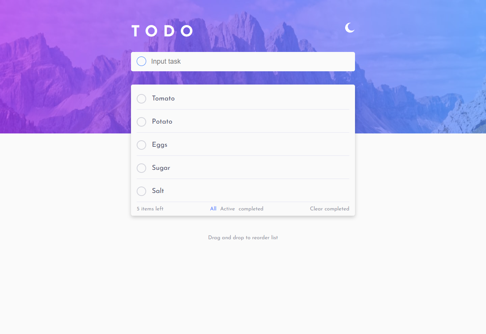

# Frontend Mentor - Todo app solution

This is a solution to the [Todo app challenge on Frontend Mentor](https://www.frontendmentor.io/challenges/todo-app-Su1_KokOW). Frontend Mentor challenges help you improve your coding skills by building realistic projects.

## Table of contents

- [Overview](#overview)
  - [The challenge](#the-challenge)
  - [Screenshot](#screenshot)
  - [Links](#links)
- [My process](#my-process)
  - [Built with](#built-with)
  - [What I learned](#what-i-learned)
  - [Continued development](#continued-development)
  - [Useful resources](#useful-resources)
- [Author](#author)
- [Acknowledgments](#acknowledgments)

## Overview

### The challenge

Users should be able to:

- View the optimal layout for the app depending on their device's screen size
- See hover states for all interactive elements on the page
- Add new todos to the list
- Mark todos as complete
- Delete todos from the list
- Filter by all/active/complete todos
- Clear all completed todos
- Toggle light and dark mode
- **Bonus**: Drag and drop to reorder items on the list

Everything is implemented including localStorage.

### Screenshot



### Links

- Solution URL: [Github](https://github.com/souravone/todoapp-io)
- Live Site URL: [Github Page](https://souravone.github.io/todoapp-io/)

## My process

### Built with

- Semantic HTML5 markup
- CSS custom properties
- Flexbox
- CSS Grid
- Desktop-first workflow
- SASS

### What I learned

How to use localStorage

```js
let tasks = JSON.parse(localStorage.getItem("tasks")) || [];
if (localStorage.getItem("tasks")) {
  tasks.map((t) => createTask(t));
}
```

How to switch themes

```js
themeIcon.onclick = function () {
  document.body.classList.toggle("dark-theme");
  if (document.body.classList.contains("dark-theme")) {
    themeIcon.src = "./images/icon-sun.svg";
    heroImage.src = "./images/bg-desktop-dark.jpg";
  } else {
    themeIcon.src = "./images/icon-moon.svg";
    heroImage.src = "./images/bg-desktop-light.jpg";
  }
};
```

How to loop arrays with map,find,findIndex etc.

### Continued development

I'd like to make this site more responsive.

### Useful resources

- [Build a TODO App With JavaScript (And Local Storage) by Envato Tuts+](https://www.youtube.com/watch?v=y71CdVq5SvI&t=2713s) - This video helped me a lot to learn how to build a todo app.

- [How To Make Website DARK MODE by Easy Tutorials](https://www.youtube.com/watch?v=9LZGB3OLXNQ) - This video helped me to understand how to implement a theme switch.

## Author

- Website - [Sourav Das](https://github.com/souravone)
- Frontend Mentor - [@souravone](https://www.frontendmentor.io/profile/souravone)
- Twitter - [@das*dev*](https://twitter.com/das_dev_)

## Acknowledgments

I'd like to thank all the members of frontendmentor.io for inspiring me to work on this project.
